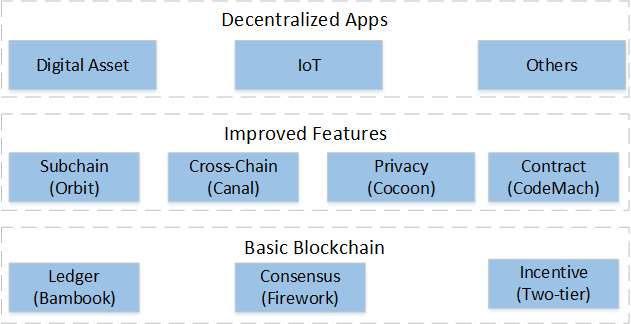

 
## __What is BUBICHAIN__
Chain is focusing on next generation platform of public Blockchain infrastructure and building a future ecosystem of Ubiquitous Trust Network. Therefore, value will be transferred freely on Blockchain just as information is transferred freely on Internet today. Lots of decentralized applications, such as digital assets and Internet of things, can be developed and deployed rapidly over CHAIN network.

## __Features__
- Flexible multi-asset and multi-operator structure of accounts and transactions.
- An improved two-stage and two-layer consensus protocol based on DPoS+BFT, called "Firework".
- A novel two-layer polymorphic architecture of multi-child Blockchain will be supported, called "Orbits".
- An Inter-Chain of routing value among Blockchains will be supported, called "Canal".
- Turing-perfect smart contract, with programming language of Javascript and WASM.
- Kinds of signature algorithms are supported, such as ED25519 and SM2.
- Built-in joint accounts to reach the control of multi-sig.
- High performance of transaction process with thousands of TPS.
- Cross-platform support, such as Linux, MacOS, Windows and Android.

## __Architecture__

## __Manual__

 - [manual document](docs/manual.md "") 

##  __Development__

 - [development document](docs/develop.md "") 

## __License__
Chain blockchain is under the bubichain license.
