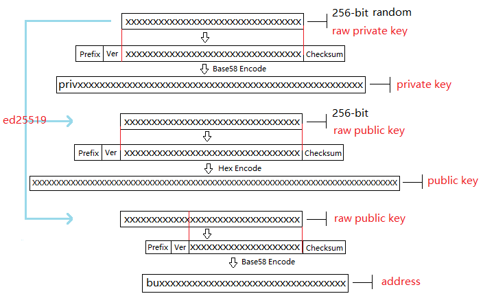

[English](keypair.md) | 中文

# BUBI Keypair 文档

## 概述
本文档详细介绍了Keypair（公、私钥对）的生成过程以及在此基础上如何生成地址（address）并对交易签名，介绍了执行交易调用的两种接口方式以及相关流程，提供了多种ProtoBuf数据结构参考信息，最后以示例的方式详细介绍了两种交易提交方式，即调用接口生成transaction_blob和自己生成transaction_blob。

## 术语定义
本章节详细介绍了该文档中用到的术语。
### Keypair
keypair是BUBICHAIN-X工程中生成公钥、私钥、地址及签名的接口。在签名过程中仅支持ED25519签名算法。
### 私钥
私钥是通过算法生成的一串字符串，是生成公钥和地址的前提条件，同时也是完成签名的基本要素。私钥生成后不能更改，一旦丢失将无法找回，因此需要妥善保管。
### 公钥
公钥是基于私钥产生的一串字符串，可以对私钥加密的字符串进行验证，在网络间传输时不会导致私钥泄露，同时也是生成地址的必要条件。
### 地址
地址是基于公钥产生的一串字符串。与现实生活中的地址类似，没有地址就无法找到联系人，因此也就无法完成交易。
### 签名
签名是指通过算法和私钥对交易数据进行加密确认并得到签名数据的过程。用户可以通过签名数据判断交易数据的完整性和正确性。
### 交易
在BUBICHAIN-X中所有修改区块链数据的操作都称为交易，比如发行资产、转移资产、发送BU、创建账号、设置metadata、设置权限等都是交易。
### Transaction Blob
Transaction Blob是指对一个交易对象进行序列化处理之后得到的16进制字符串。交易序列化是指通过ProtoBuf数据结构将交易对象的状态信息转换成可以存储和传输的字符串的过程。
### Raw Private Key
Raw Private Key 是指通过随机算法得到的字节数组，该字节数组是生成私钥的前提条件。
### Raw Public Key
Raw Public Key 是指通过ED25519算法对 raw private key 进行处理生成的字节数组，该字节数组是生成公钥的前提条件。
### 原理图
下图说明了私钥、公钥和地址的生成原理。

## 生成私钥
生成私钥需要使用随机算法、SHA256等多个算法才能实现。生成私钥包括以下步骤：
1. 利用随机算法生成一个256位的随机数（数学意义上的私钥），得到字节数组即 raw private key，如下所示：
> [17,236,24,183,207,250,207,180,108,87,224,39,189,99,246,85,138,120,236,78,228,233,41,192,124,109,156,104,235,66,194,24]
2. 在 raw private key 前面加上3个字节的前缀（Prefix），然后再加上1个字节的版本号（Version），得到新的字节数组，如下所示：
> [218,55,159,1,17,236,24,183,207,250,207,180,108,87,224,39,189,99,246,85,138,120,236,78,228,233,41,192,124,109,156,104,235,66,194,24]

>**说明**：关于Prefix、Version以及Checksum请查看表1。
3. 对第2步中得到的字节数组进行两次SHA256计算，取运算结果的前4个字节，得到校验码（Checksum）的字节数组，如下所示：
> [30,19,80,117]
4. 将第2步中的字节数组和第3步中的校验码字节数组按照先后顺序连接在一起，得到新的字节数组，如下所示：
> [218,55,159,1,17,236,24,183,207,250,207,180,108,87,224,39,189,99,246,85,138,120,236,78,228,233,41,192,124,109,156,104,235,66,194,24,30,19,80,117]
5. 对第4步中产生的字节数组进行Base58编码，得到以priv开始的字符串，即私钥（private key），如下所示：
> privbsGZFUoRv8aXZbSGd3bwzZWFn3L5QKq74RXAQYcmfXhhZ54CLr9z

>**说明**：至此就完成了私钥的生成。

表1

|   名称     |                数据内容                   | 长度  |
|----------- | ----------------------------------------- | ----- |
|   Prefix   | 0xDA 0x37 0x9F                            | 3个字节 |
|   Version      | 0x01                                      | 1个字节 |
|   Checksum | 对第2步中得到的字节数组进行两次SHA256运算之后，取运算结果的前4个字节  | 4个字节 |
该表对生成私钥中使用到的Prefix、Version以及Checksum进行了说明。
## 生成公钥
生成公钥需要在生成私钥之后才能实现，需要用到ED25519算法。生成公钥包含以下步骤：
1. 通过ED25519算法对raw private key进行处理生成32位的字节数组，即raw public key。例如私钥是 privbsGZFUoRv8aXZbSGd3bwzZWFn3L5QKq74RXAQYcmfXhhZ54CLr9z，其raw public key如下所示：
> [21,118,76,208,23,224,218,117,50,113,250,38,205,82,148,81,162,27,130,83,208,1,240,212,54,18,225,158,198,50,87,10]
2. 在raw public key 前面加上1个字节的前缀（Prefix），然后再加上1个字节的版本号（Version），得到新的字节数组，如下所示：
> [176,1,21,118,76,208,23,224,218,117,50,113,250,38,205,82,148,81,162,27,130,83,208,1,240,212,54,18,225,158,198,50,87,10]

>**说明**：关于Prefix、Version以及Checksum请查看表2。
3. 对第2步中的字节数组进行两次SHA256计算，取运算结果的前4个字节，得到校验码（Checksum）的字节数组，如下所示：
> [116,171,22,107]
4. 将第2步中的字节数组和3步的校验码字节数组按照先后顺序连接在一起，得到新的字节数组，如下所示：
[176,1,21,118,76,208,23,224,218,117,50,113,250,38,205,82,148,81,162,27,130,83,208,1,240,212,54,18,225,158,198,50,87,10,116,171,22,107]
5. 对第4步中的字节数组进行16进制编码，得到16进制字符串，即公钥（public key），如下所示：
> b00115764cd017e0da753271fa26cd529451a21b8253d001f0d43612e19ec632570a74ab166b

>**说明**：至此就完成了公钥的生成。

表2
|   名称     |                数据内容                   | 长度  |
|----------- | ----------------------------------------- | ----- |
|   Prefix   | 0xB0                                      | 1个字节 |
|   Version      | 0x01                                      | 1个字节 |
|   Checksum | 对第2步中得到的字节数组进行两次SHA256运算之后，取运算结果的前4个字节  | 4个字节 |
该表对生成公钥中使用到的Prefix、Version以及Checksum进行了说明。
## 生成地址
在生成私钥和公钥后可以进一步通过算法生成地址。生成地址包含以下步骤：
1. 通过ED25519算法对raw private key进行处理生成32位的字节数组，即 raw public key。例如私钥为 privbsGZFUoRv8aXZbSGd3bwzZWFn3L5QKq74RXAQYcmfXhhZ54CLr9z，其raw public key 如下所示：
> [21,118,76,208,23,224,218,117,50,113,250,38,205,82,148,81,162,27,130,83,208,1,240,212,54,18,225,158,198,50,87,10]
2. 对 raw public key 进行两次SHA256运算，并取运算结果的后20位字节，得到字节数组，如下所示：
> [173,148,59,51,183,193,55,160,1,133,247,80,65,13,67,190,164,114,18,220]
3. 在第2步产生的字节数组前面加上2个字节的前缀（Prefix），然后再加上1个字节的版本号（Version），得到新的字节数组，如下所示：
> [1,86,1,173,148,59,51,183,193,55,160,1,133,247,80,65,13,67,190,164,114,18,220]

>**说明**：关于Prefix、Version以及Checksum请查看表3。
4. 对第3步中的字节数组进行两次SHA256计算，取运算结果的前4个字节，得到校验码（Checksum）的字节数组，如下所示：
> [167,127,34,35]
5. 将第3步中的字节数组和第4步的校验码字节数组按照先后顺序连接在一起，得到新的字节数组，如下所示：
> [1,86,1,173,148,59,51,183,193,55,160,1,133,247,80,65,13,67,190,164,114,18,220,167,127,34,35]
6. 对第5步中产生的字节数组进行Base58编码，得到以bu开头的字符串，即地址（address），如下所示：
> buQmWJrdYJP5CPKTbkQUqscwvTGaU44dord8

>**说明**：至此就完成了地址的生成。

表3
|   名称     |                数据内容                   |  长度  |
|----------- | ----------------------------------------- | ------ |
|   Prefix   | 0x01 0x56                                 | 2个字节  |
|   Version      | 0x01                                      | 1个字节  |
|   PublicKey| 取raw public key的后20个字节                | 20个字节 |
|   Checksum | 对第3步中得到的字节数组进行两次SHA256运算之后，取运算结果的前4个字节  | 4个字节  |
该表对生成地址中使用到的Prefix、Version以及Checksum进行了说明。
## 交易签名
借助ED25519算法和私钥对待签名的交易（transaction_blob的反16进制编码得到的字节数组）进行签名，并进行16进制转换，得到签名字符串sign_data。

下面的示例展示了如何用ED25519和私钥对transaction_blob签名。

私钥是：

```
b00115764cd017e0da753271fa26cd529451a21b8253d001f0d43612e19ec632570a74ab166b
```

Transaction_blob是:

```
0A24627551566B5555424B70444B526D48595777314D553855376E676F5165686E6F31363569109F0818C0843D20E80732146275696C642073696D706C65206163636F756E743A5F08011224627551566B5555424B70444B526D48595777314D553855376E676F5165686E6F3136356922350A246275516E6936794752574D4D454376585850673854334B35615A557551456351523670691A0608011A02080128C7A3889BAB20
```

用ED25519的签名接口对transaction_blob进行签名，并进行16进制转换后，得到的sign_data是：

```
a46ee590a84abdeb8cc38ade1ae8e8a2c71bb69bdc4cd7dc0de1b74b37e2cbd1696229687f80dff4276b1a3dd3f95a9bc1d569943b337fe170317430f36d6401
```
## 交易提交方式
交易的执行有两种接口调用方式：调用接口生成transaction_blob 和自己生成 transaction_blob。
### 调用接口生成transation_blob
>**注意**：由于transaction_blob很可能被截取和篡改，因此不建议用这种方式生成transaction_blob。

如果需要调用接口生成transaction_blob、签名并提交交易，请查看bubi的开发文档，地址如下：

[develop.md](./develop.md)
 
调用接口生成transation_blob包含以下步骤：
1. 调用getAccount接口获取待发起交易账户的nonce值，代码如下所示：

```
          HTTP GET host:port/getAccount?address=账户地址
```
2. 根据需要填充json数据并完成交易数据填充，格式如下所示：


```
    {
        "source_address":"xxxxxxxxxxx", //交易源账号，即交易的发起方
        "nonce":2, //nonce的值
        "ceil_ledger_seq": 0, //可选
        "fee_limit":1000, //交易支付的费用
        "gas_price": 1000, //gas价格(不小于配置的最低值)
        "metadata":"0123456789abcdef", //可选，用户自定义给交易的备注，16进制格式
        "operations":[
        {
            //根据不同的操作填写
        },
        {
            //根据不同的操作填写
        }
            ......
        ]
    }
```
>**注意**：nonce值需要在第1步中获取值的基础上加1。
3. 通过调用getTransactionBlob接口将第2步中生成的json数据作为参数传入，得到一个交易hash和transaction_blob，实现交易序列化，格式如下所示：

```
    {
        "error_code": 0,
        "error_desc": "",
        "result": {
            "hash": "xxxxxxxxxxxxxxxxxxxxxxxxxxxxxxxxxxxxxxxxxxxxxxxxxx", //交易的hash
            "transaction_blob": "xxxxxxxxxxxxxxxxxxxxxxxxxxxxxxxxxx" //交易序列化之后的16进制表示
        }
    }
``` 

4. 对交易进行签名并填充交易数据。根据之前生成的私钥对transaction_blob签名，然后填充提交交易的json数据，格式如下所示：

```
    {
        "items" : [{
            "transaction_blob" : "xxxxxxxxxxxxxxxxxxxxxxxxxxxxxxxxxxxxxxxxxxxxx", //一个交易序列化之后的16进制表示
            "signatures" : [{//第一个签名
                "sign_data" : "xxxxxxxxxxxxxxxxxxxxxxxxxxxxxxxxxxxxxxxxxxx", //签名数据
                "public_key" : "xxxxxxxxxxxxxxxxxxxxxxxxxxxxxxxxxxxxxx" //公钥
            }, {//第二个签名
                "sign_data" : "xxxxxxxxxxxxxxxxxxxxxxxxxxxxxxxxxxxxxxxxxxx", //签名数据
                "public_key" : "xxxxxxxxxxxxxxxxxxxxxxxxxxxxxxxxxxxxxx" //公钥
            }
            ]
        }
        ]
    }
```

5. 通过调用submitTransaction接口，将第4步中生成的json数据作为参数传入，得到响应结果，完成交易提交。响应结果的格式如下所示：

```
    {
        "results": [
        {
            "error_code": 0,
            "error_desc": "",
            "hash": "xxxxxxxxxxxxxxxxxxxxxxxxxxxxxxxxxxxxxxxxxxxxxxxxxx" //交易的hash
        }
        ],
        "success_count": 1
    }
```
### 自己生成transation_blob
自己生成transaction_blob、签名，并提交交易，具体操作包括以下步骤：

1. 通过调用getAccount接口获取待发起交易的账户的nonce值，如下所示：

```
          HTTP GET host:port/getAccount?address=账户地址
```
          
2. 填充protocol buffer的交易对象Transaction，并进行序列化操作，从而得到transaction_blob。具体的交易数据结构详情请看[ProtoBuf数据结构](#protobuf数据结构)。

3. 签名交易，并填充交易数据。根据私钥生成公钥，并用私钥对transaction_blob签名，然后填充提交交易的json数据，格式如下：

```
    {
        "items" : [{
            "transaction_blob" : "xxxxxxxxxxxxxxxxxxxxxxxxxxxxxxxxxxxxxxxxxxxxx", //一个交易序列化之后的16进制表示
            "signatures" : [{//第一个签名
                "sign_data" : "xxxxxxxxxxxxxxxxxxxxxxxxxxxxxxxxxxxxxxxxxxx", //签名数据
                "public_key" : "xxxxxxxxxxxxxxxxxxxxxxxxxxxxxxxxxxxxxx" //公钥
            }, {//第二个签名
                "sign_data" : "xxxxxxxxxxxxxxxxxxxxxxxxxxxxxxxxxxxxxxxxxxx", //签名数据
                "public_key" : "xxxxxxxxxxxxxxxxxxxxxxxxxxxxxxxxxxxxxx" //公钥
            }
            ]
        }
        ]
    }
```
          
4. 通过调用submitTransaction接口，将第3步生成的json数据作为参数传入，完成交易提交。响应结果格式如下：

```
    {
        "results": [
        {
            "error_code": 0,
            "error_desc": "",
            "hash": "xxxxxxxxxxxxxxxxxxxxxxxxxxxxxxxxxxxxxxxxxxxxxxxxxx" //交易的hash
        }
        ],
        "success_count": 1
    }
```
## ProtoBuf数据结构

Protocol Buffers（ProtoBuf） 是一种轻便高效的结构化数据存储格式，可以用于结构化数据串行化，或者说序列化。它很适合做数据存储或 RPC 数据交换格式。可用于通讯协议、数据存储等领域的语言无关、平台无关、可扩展的序列化结构数据格式。目前提供了 C++、Java、Python 三种语言的 API。

要了解更多关于ProtoBuf的信息，请查看以下链接：

https://developers.google.com/protocol-buffers/docs/overview

接下来将介绍Protocol Buffer的数据结构详情，并提供针对脚本生成的各种语言的protocol buffer的文件和简单测试程序。

### 数据结构
下面介绍了交易中可能用到的各种ProtoBuf数据结构及其用途，供用户参考使用。

1. Transaction

> 该数据结构适用于完整的交易。

```
    message Transaction {
	    enum Limit{
		    UNKNOWN = 0;
		    OPERATIONS = 1000;
	    };
        string source_address = 1;                 // 交易发起账户地址
        int64 nonce = 2;                           // 交易序列号
        int64  fee_limit = 3;                      // 交易费用，默认1000Gas，单位是MO，1 BU = 10^8 MO
        int64  gas_price = 4;                       // 交易打包费用，默认是1000，单位是MO，1 BU = 10^8 MO
        int64 ceil_ledger_seq = 5;                 // 区块高度限制
        bytes metadata = 6;                        // 交易备注
        repeated Operation operations = 7;         // 操作列表
    }
```

2. Operation

> 该数据结构适用于交易中的操作。
 
 ```
    message Operation {
        enum Type {
            UNKNOWN = 0;
            CREATE_ACCOUNT = 1;
            ISSUE_ASSET = 2;
            PAY_ASSE = 3;
            SET_METADATA = 4;
            SET_SIGNER_WEIGHT = 5;
            SET_THRESHOLD = 6;
            PAY_COIN = 7;
            LOG = 8;
            SET_PRIVILEGE = 9;
        };
        Type type = 1;                             // 操作类型 
        string source_address = 2;                 // 操作源账户地址
        bytes metadata = 3;                        // 操作备注
        
        OperationCreateAccount create_account = 4;            // 创建账户操作
        OperationIssueAsset issue_asset = 5;                  // 发行资产操作
        OperationPayAsset pay_asset = 6;                      // 转移资产操作
        OperationSetMetadata set_metadata = 7;                // 设置metadata
        OperationSetSignerWeight set_signer_weight = 8;       // 设置签名者权限
        OperationSetThreshold	 set_threshold = 9;           // 设置交易门限
        OperationPayCoin pay_coin = 10;                       // 转移coin
        OperationLog log = 11;                                // 记录log
        OperationSetPrivilege set_privilege = 12;             // 设置权限
     }
```

3. OperationCreateAccount

> 该数据结构用于创建账户。

```
    message OperationCreateAccount{
        string dest_address = 1;                  // 待创建的目标账户地址
        Contract contract = 2;                    // 合约
        AccountPrivilege priv = 3;                // 权限
        repeated KeyPair metadatas = 4;           // 附加信息
        int64	init_balance = 5;                 // 初始化余额
        string  init_input = 6;                   // 合约入参
    }
```  
     

4. Contract

> 该数据结构用于设置合约。

```
    message Contract{
        enum ContractType{
            JAVASCRIPT = 0;
        }
        ContractType type = 1;                   // 合约类型
        string payload = 2;                      // 合约代码
    }
```

5. AccountPrivilege

> 该数据结构用于设置账户权限。

```
    message AccountPrivilege {
        int64 master_weight = 1;                 // 账户自身权重
        repeated Signer signers = 2;             // 签名者权重列表
        AccountThreshold thresholds = 3;         // 门限
    }
```

6. Signer

> 该数据结构用于设置签名者权重。

```
    message Signer {
        enum Limit{
        	SIGNER_NONE = 0;
        	SIGNER = 100;
        };
        string address = 1;                      // 签名者账户地址
        int64 weight = 2;                        // 签名者权重
    }
```

7. AccountThreshold

> 该数据结构用于设置账户门限。

```
    message AccountThreshold{
        int64 tx_threshold = 1;                                 // 交易门限
        repeated OperationTypeThreshold type_thresholds = 2;    // 指定操作的交易门限列表，未指定的操作的交易以tx_threshold为门限
    }
```
8. OperationTypeThreshold

> 该数据结构用于指定类型的操作门限。

```
    message OperationTypeThreshold{
        Operation.Type type = 1;                 // 操作类型
        int64 threshold = 2;                     // 该操作对应的门限
    }
```

9. OperationIssueAsset

> 该数据结构用于发行资产。

```
    message OperationIssueAsset{
        string code = 1;                         // 待发行的资产编码
        int64 amount = 2;                        // 待发行的资产数量
    }
```

10. OperationPayAsset

> 该数据结构用于转移资产。

```
    message OperationPayAsset {
        string dest_address = 1;                 // 目标账户地址
        Asset asset = 2;                         // 资产
        string input = 3;                        // 合约入参
    }
```

11. Asset

> 该数据结构适用于资产。

```
    message Asset{
        AssetKey	key = 1;                      // 资产标识
        int64		amount = 2;                   // 资产数量
    }
```

12. AssetKey

>该数据结构用于标识资产唯一性。

```
    message AssetKey{
        string issuer = 1;                       //  资产发行账户地址
        string code = 2;                         //  资产编码
        int32 type = 3;                          //  资产类型（默认为0，表示不限制数量）
    }
```

13. OperationSetMetadata

> 该数据结构用于设置Metadata。

```
    message OperationSetMetadata{
        string	key = 1;                         // 关键字，惟一
        string  value = 2;                       // 内容
        int64 	version = 3;                     // 版本控制，可不设置
        bool    delete_flag = 4;                 // 是否删除
    }
```

14. OperationSetSignerWeight

> 该数据结构用于设置签名者权重。

```
    message OperationSetSignerWeight{
        int64 master_weight = 1;                 // 自身权重
        repeated Signer signers = 2;             // 签名者权重列表
    }
```

15. OperationSetThreshold

> 该数据结构用于设置门限。

```
    message OperationSetThreshold{
        int64 tx_threshold = 1;                               // 交易门限
        repeated OperationTypeThreshold type_thresholds = 2;  // 指定操作的交易门限列表，未指定的操作的交易以tx_threshold为门限
    }
```

16. OperationPayCoin

> 该数据结构用于发送coin。

```
    message OperationPayCoin{
        string dest_address = 1;                 // 目标账户地址
        int64 amount = 2;                        // coin的数量
        string input = 3;                        // 合约入参
    }
```

17. OperationLog数据结构

> 该数据结构用于记录log信息。

```
    message OperationLog{
        string topic = 1;                        // 日志主题
        repeated string datas = 2;               // 日志内容
    }
```

18. OperationSetPrivilege数据结构

> 该数据结构用于设置账户权限。

```
    message OperationSetPrivilege{
        string master_weight = 1;                            // 账户自身权重
        repeated Signer signers = 2;                         // 签名者权重列表
        string tx_threshold = 3;                             // 交易门限
        repeated OperationTypeThreshold type_thresholds = 4; // 指定操作的交易门限列表，未指定的操作的交易以tx_threshold为门限
    }

```
### 使用示例

> 本节中提供了proto脚本，以及cpp、java、javascript、pyton、object-c和php生成的proto源码的示例，详细信息请查看以下链接: [proto](../src/proto)

链接中的目录结构说明：

1. cpp: C++的源码
2. io: Java的源码
3. go: Go的源码及测试程序
4. js: Javascript的源码及测试程序
5. python: Python的源码及测试程序
6. ios: Object-c的源码及测试程序
7. php: PHP的源码及测试程序

## 交易提交示例

> 场景：账户A （“buQVkUUBKpDKRmHYWw1MU8U7ngoQehno165i”）创建账户B（通过[Keypair](#keypair)中的[生成地址](#生成地址)来生成新账户地址）。

### 接口生成transaction_blob示例
通过接口生成transaction_blob包含以下步骤：
1. 通过GET获取待发起交易账户的nonce值。

```
    GET http://ip:port/getAccount?address=buQsurH1M4rjLkfjzkxR9KXJ6jSu2r9xBNEw
```

得到的响应报文：

```
    {
            "error_code" : 0,
            "result" : {
                  "address" : "buQsurH1M4rjLkfjzkxR9KXJ6jSu2r9xBNEw",
                  "assets" : [
                  {
                       "amount" : 1000000000,
                       "key" : {
                           "code" : "HNC",
                           "issuer" : "buQBjJD1BSJ7nzAbzdTenAhpFjmxRVEEtmxH"
                       }
                  }
                  ],
                  "assets_hash" : "3bf279af496877a51303e91c36d42d64ba9d414de8c038719b842e6421a9dae0",
                  "balance" : 27034700,
                  "metadatas" : null,
                  "metadatas_hash" : "ad67d57ae19de8068dbcd47282146bd553fe9f684c57c8c114453863ee41abc3",
                  "nonce" : 5,
                  "priv" : {
                        "master_weight" : 1,
                        "thresholds" : [{
                              "tx_threshold" : 1
                        }
                        ]
                  }
           }
    }
    address: 当前查询的账户地址
    assets: 账户资产列表
    assets_hash: 资产列表hash
    balance: 账户资产余额
    metadata: 交易备注，必须是16进制
    metadatas_hash: 交易备注hash
    nonce: 转出方交易序列号，通过查询账户信息接口返回的nonce + 1
    priv: 权限
    master_weight: 当前账户权重
    thresholds: 门限
    tx_threshold: 交易默认门限
```

2. 完成交易数据填充。

通过 [keypair](#keypair)中的 [生成地址](#生成地址)生成的新账户B的地址是“buQoP2eRymAcUm3uvWgQ8RnjtrSnXBXfAzsV”，填充的json数据如下：

```
         {
             "source_address":"buQsurH1M4rjLkfjzkxR9KXJ6jSu2r9xBNEw",
             "nonce":7,
             "ceil_ledger_seq": 0,
             "fee_limit":1000000, 
             "gas_price": 1000,
             "metadata":"",
             "operations":[
             {
                 "type": 1,
                 "create_account": {
                     "dest_address": "buQoP2eRymAcUm3uvWgQ8RnjtrSnXBXfAzsV",
                     "init_balance": 10000000, 
                     "priv": {
                         "master_weight": 1,
                         "thresholds": {
                             "tx_threshold": 1
                         }
                     }
                  }
              }
              ]
}
```
>**注意**：这里的nonce值不是6，没有连续，因此该交易会超时，不会成功。

3. 对交易数据进行序列化处理。

```
         POST http://ip:port/getTransactionBlob
```

请求报文: 
    
    4.1.2中填充的json数据
        
响应报文:

```
{
                "error_code": 0,
                "error_desc": "",
                "result": {
                    "hash": "be4953bce94ecd5c5a19c7c4445d940c6a55fb56370f7f606e127776053b3b51",
                    "transaction_blob": "0a2462755173757248314d34726a4c6b666a7a6b7852394b584a366a537532723978424e4577100718c0843d20e8073a37080122330a246275516f50326552796d4163556d33757657675138526e6a7472536e58425866417a73561a0608011a0208012880ade204"
                 }
}
```

4. 通过私钥对交易（transaction_blob）签名。


> 导入包:import io.chain.encryption.key.PrivateKey;
 

    私钥是:
    privbvTuL1k8z27i9eyBrFDUvAVVCSxKeLtzjMMZEqimFwbNchnejS81
    
    签名后的sign_data是：
    9C86CE621A1C9368E93F332C55FDF423C087631B51E95381B80F81044714E3CE3DCF5E4634E5BE77B12ABD3C54554E834A30643ADA80D19A4A3C924D0B3FA601
         
5. 完成交易数据填充。

```
    {
        "items" : [{
            "transaction_blob" : "0a2462755173757248314d34726a4c6b666a7a6b7852394b584a366a537532723978424e4577100718c0843d20e8073a37080122330a246275516f50326552796d4163556d33757657675138526e6a7472536e58425866417a73561a0608011a0208012880ade204",                        
            "signatures" : [{
                "sign_data" : "9C86CE621A1C9368E93F332C55FDF423C087631B51E95381B80F81044714E3CE3DCF5E4634E5BE77B12ABD3C54554E834A30643ADA80D19A4A3C924D0B3FA601",
                "public_key" : "b00179b4adb1d3188aa1b98d6977a837bd4afdbb4813ac65472074fe3a491979bf256ba63895"
             }
             ]
        }
        ]
    }
```

6. 通过POST提交交易。

```
     POST http://ip/submitTransaction
     
```

得到如下的响应报文：

```
    {
        "results": [{
            "error_code": 0,
            "error_desc": "",
            "hash": "be4953bce94ecd5c5a19c7c4445d940c6a55fb56370f7f606e127776053b3b51"
        }
        ],
        "success_count": 1
    }
```
>**说明**：“success_count”:1表示提交成功。

### 自己生成transaction_blob示例
自己生成transaction_blob（以Java为例）包含以下步骤：
1. 通过GET获取待发起交易账户的nonce值。

```
    GET http://ip:port/getAccount?address=buQsurH1M4rjLkfjzkxR9KXJ6jSu2r9xBNEw
```

得到的响应报文：

```
    {
            "error_code" : 0,
            "result" : {
                  "address" : "buQsurH1M4rjLkfjzkxR9KXJ6jSu2r9xBNEw",
                  "assets" : [
                  {
                       "amount" : 1000000000,
                       "key" : {
                           "code" : "HNC",
                           "issuer" : "buQBjJD1BSJ7nzAbzdTenAhpFjmxRVEEtmxH"
                       }
                  }
                  ],
                  "assets_hash" : "3bf279af496877a51303e91c36d42d64ba9d414de8c038719b842e6421a9dae0",
                  "balance" : 27034700,
                  "metadatas" : null,
                  "metadatas_hash" : "ad67d57ae19de8068dbcd47282146bd553fe9f684c57c8c114453863ee41abc3",
                  "nonce" : 5,
                  "priv" : {
                        "master_weight" : 1,
                        "thresholds" : [{
                              "tx_threshold" : 1
                        }
                        ]
                  }
           }
    }
    address: 当前查询的账户地址
    assets: 账户资产列表
    assets_hash: 资产列表hash
    balance: 账户资产余额
    metadata: 交易备注，必须是16进制
    metadatas_hash: 交易备注hash
    nonce: 转出方交易序列号，通过查询账户信息接口返回的nonce + 1
    priv: 权限
    master_weight: 当前账户权重
    thresholds: 门限
    tx_threshold: 交易默认门限
```

2. 填充交易（Transaction）数据结构，并生成transaction_blob。

> 导入包:import io.chain.sdk.core.extend.protobuf.Chain;


```
    Chain.Transaction.Builder builder = Chain.Transaction.newBuilder();
    builder.setSourceAddress("buQsurH1M4rjLkfjzkxR9KXJ6jSu2r9xBNEw");
    builder.setNonce(7);
    
    builder.setFeeLimit(1000 * 1000);
    builder.setGasPrice(1000);
    builder.setCeilLedgerSeq(0);
    builder.setMetadata(ByteString.copyFromUtf8(""));
    
    Chain.Operation.Builder operation = builder.addOperationsBuilder();
    operation.setType(Chain.Operation.Type.CREATE_ACCOUNT);
    
    Chain.OperationCreateAccount.Builder operationCreateAccount = Chain.OperationCreateAccount.newBuilder();
    operationCreateAccount.setDestAddress("buQoP2eRymAcUm3uvWgQ8RnjtrSnXBXfAzsV");
    operationCreateAccount.setInitBalance(10000000);
    
    Chain.AccountPrivilege.Builder accountPrivilegeBuilder = Chain.AccountPrivilege.newBuilder();
    accountPrivilegeBuilder.setMasterWeight(1);
    
    Chain.AccountThreshold.Builder accountThresholdBuilder = Chain.AccountThreshold.newBuilder();
    accountThresholdBuilder.setTxThreshold(1);
    
    accountPrivilegeBuilder.setThresholds(accountThresholdBuilder);
    operationCreateAccount.setPriv(accountPrivilegeBuilder);
    operation.setCreateAccount(operationCreateAccount);
    String transaction_blob = HexFormat.byteToHex(builder.build().toByteArray());
    
    得到的transaction_blob是：
    0a2462755173757248314d34726a4c6b666a7a6b7852394b584a366a537532723978424e4577100718c0843d20e8073a37080122330a246275516f50326552796d4163556d33757657675138526e6a7472536e58425866417a73561a0608011a0208012880ade204
```
>**注意**：这里的nonce值不是6，没有连续，因此该交易会超时，不会成功。

3. 通过私钥对交易（transaction_blob）签名。

> 导入包:import io.chain.encryption.key.PrivateKey;
 

    私钥是：
    privbvTuL1k8z27i9eyBrFDUvAVVCSxKeLtzjMMZEqimFwbNchnejS81
    
    签名后的sign_data是：
    9C86CE621A1C9368E93F332C55FDF423C087631B51E95381B80F81044714E3CE3DCF5E4634E5BE77B12ABD3C54554E834A30643ADA80D19A4A3C924D0B3FA601
         
4. 完成交易数据填充。

```
    {
        "items" : [{
            "transaction_blob" : "0a2462755173757248314d34726a4c6b666a7a6b7852394b584a366a537532723978424e4577100718c0843d20e8073a37080122330a246275516f50326552796d4163556d33757657675138526e6a7472536e58425866417a73561a0608011a0208012880ade204",                        
            "signatures" : [{
                "sign_data" : "9C86CE621A1C9368E93F332C55FDF423C087631B51E95381B80F81044714E3CE3DCF5E4634E5BE77B12ABD3C54554E834A30643ADA80D19A4A3C924D0B3FA601",
                "public_key" : "b00179b4adb1d3188aa1b98d6977a837bd4afdbb4813ac65472074fe3a491979bf256ba63895"
             }
             ]
        }
        ]
    }
```

5. 通过POST提交交易。

```
     POST http://ip/submitTransaction
     
```
得到的响应报文：

```
    {
        "results": [{
            "error_code": 0,
            "error_desc": "",
            "hash": "be4953bce94ecd5c5a19c7c4445d940c6a55fb56370f7f606e127776053b3b51"
        }
        ],
        "success_count": 1
    }
```
>**说明**："success_count":1表明交易提交成功。
